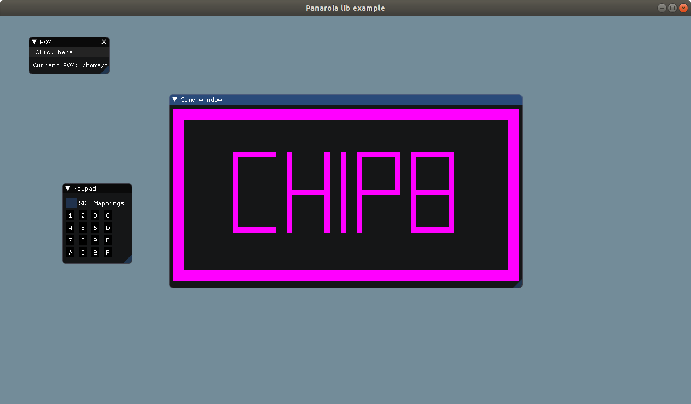

# panaroia

A small Chip8 emulator library in C

# Instructions

## Building

panaroia depends on [log.c](https://github.com/rxi/log.c) for logging inside the library, [Dear ImGui](https://github.com/ocornut/imgui) and [imgui-filebrowser](https://github.com/AirGuanZ/imgui-filebrowser) to build the sample ui implementation.

To the third party dependencies added as submodules, run:

```shell
$ git submodule update --init
```

Create a build directory and get the conan dependencies:

```shell
$ mkdir build
$ cd build
$ conan install ..
```

Run CMake and build:

```shell
$ cmake ..
$ make
```

If everything went fine, you can check the sample UI made with imgui by running:

```shell
$ ./interfaces/panaroia-imgui/bin/panaroia-imgui
```

To execute the libcheck unit tests, run:

```shell
$ ./tests/panaroia-tests
```

## Sample UI

The sample UI looks like this:



In the ROM window, you can select a Chip8 rom to be loaded or reset the current loaded rom file, the Keypad window displays the current keys state and toggling the SDL Mappings will display the actual keys bound to Chip8 keys.
